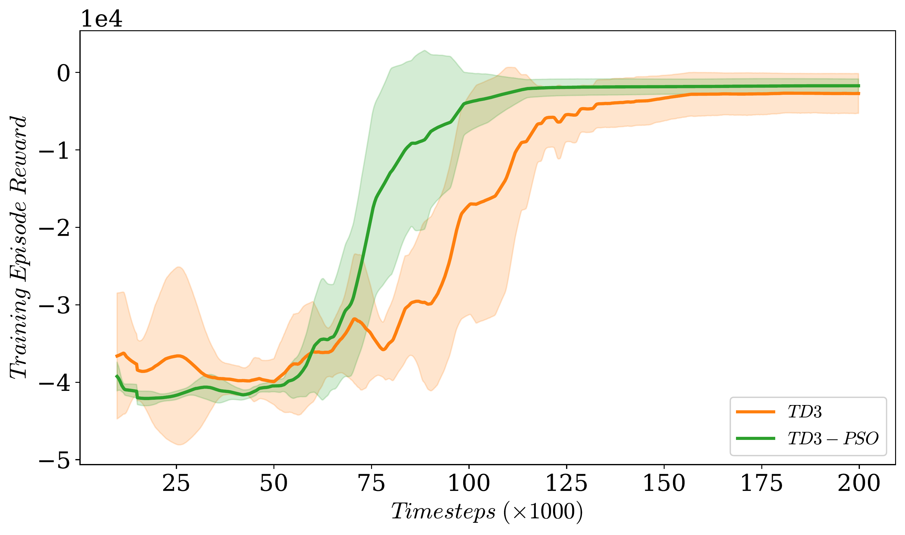
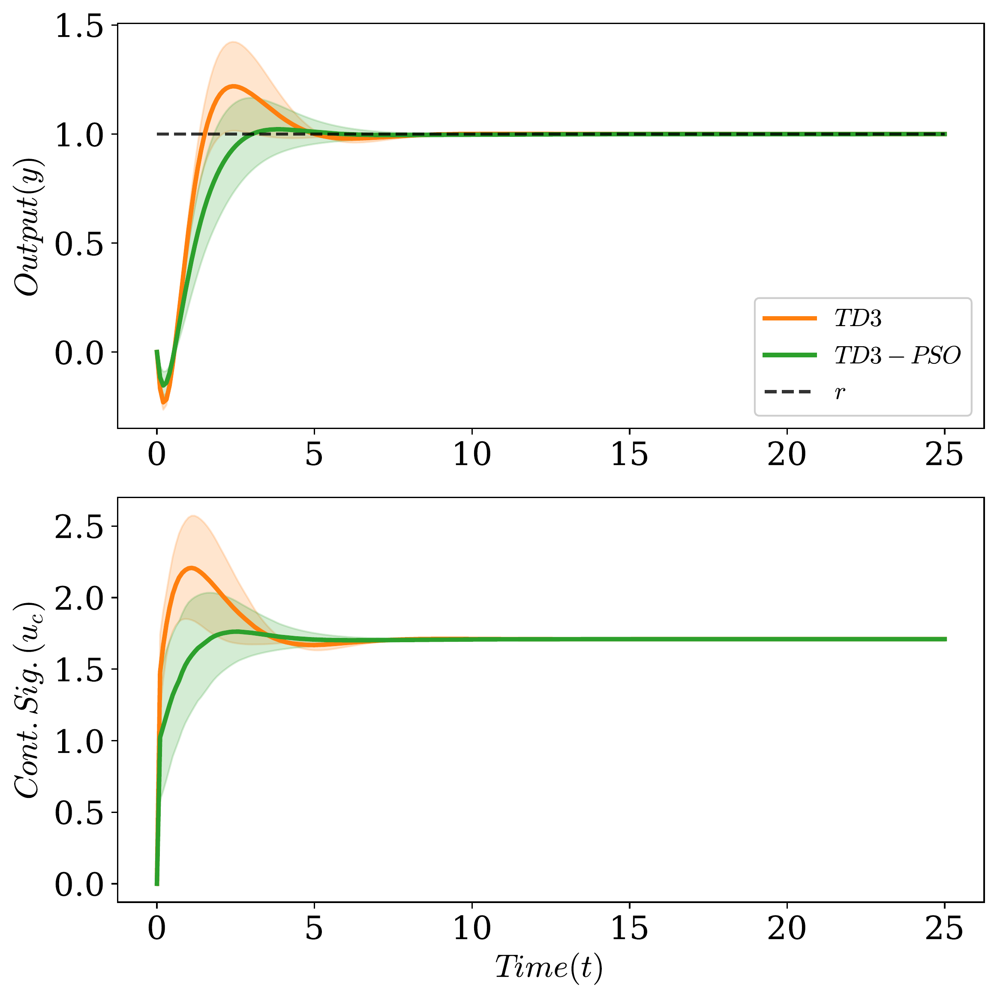
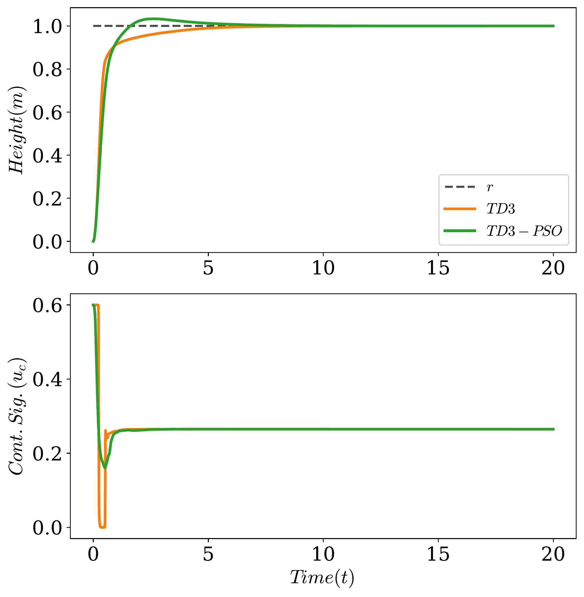

# TD3-PSO: Enhanced Deep Policy Gradient for Continuous Control

This repository contains the implementation of **TD3-PSO**, a reinforcement learning algorithm that enhances Twin Delayed Deep Deterministic Policy Gradient (TD3) with Particle Swarm Optimisation (PSO) principles for improved continuous control.

## Overview

Deep reinforcement learning provides a model-free approach to learning control policies directly from experience. However, standard algorithms face challenges including sample inefficiency, fixed exploration strategies, and convergence to local optima. TD3-PSO addresses these limitations by integrating three mechanisms inspired by PSO:

1. **Return-weighted prioritised experience replay** - Focuses learning on successful trajectories
2. **Adaptive exploration noise** - Adjusts exploration based on performance trends
3. **PSO-style actor perturbations** - Enables escaping local optima through periodic parameter perturbations

## Key Results

### CSTR Control (Non-Minimum Phase System)
- **64.5% improvement** in best evaluation reward
- **94.7% reduction** in variance across random seeds
- **66% reduction** in overshoot
- **24% improvement** in control smoothness (IACER)
- **16% lower** peak control effort


*Learning performance comparison across 5 random seeds on CSTR control*


*CSTR step response comparison showing improved transient behaviour*

### Crazyflie Nano-Quadcopter
- Smoother altitude tracking with reduced oscillations
- Successful sim-to-real transfer on physical hardware
- Faster convergence to hover equilibrium


*Simulation comparison for altitude control*


*Hardware deployment on Crazyflie 2.1+ nano-quadcopter*

## Installation

```bash
# Clone the repository
git clone https://github.com/Klins101/TD3-PSO.git
cd TD3-PSO

# Install dependencies
pip install -r requirements.txt
```

**Requirements:**
- Python ≥ 3.7
- PyTorch ≥ 1.9
- NumPy, Matplotlib, SciPy

For Crazyflie hardware experiments (optional):
```bash
pip install cflib
```

## Repository Structure

```
TD3-PSO/
├── cstr/                          # CSTR control experiments
│   ├── training/                  # Training scripts
│   │   ├── train_td3.py           # Baseline TD3 training
│   │   ├── train_td3_pso.py       # TD3-PSO training
│   │   ├── agents/                # TD3 and TD3-PSO implementations
│   │   ├── environment/           # CSTR environment
│   │   └── config.py              # Hyperparameters
│   └── data/                      # Trained models and results
│       └── trained_models/        # Models for all seeds
├── crazyflie/                     # Crazyflie experiments
│   ├── training/                  # Training scripts
│   ├── hardware_deployment/       # Real hardware deployment
│   └── data/                      # Flight data
└── plots/                         # figures
```

## Quick Start

### Training CSTR Controller

```bash
cd cstr/training

# Train baseline TD3
python train_td3.py

# Train TD3-PSO
python train_td3_pso.py

# Train both algorithms with multiple seeds
python train_all.py
```

**Configuration:**
- Episodes: 200,000 timesteps
- Network: 2 hidden layers × 64 units (ReLU)
- Batch size: 256
- Learning rates: Actor 1×10^-4, Critic 1×10^-4

### Training Crazyflie Controller

```bash
cd crazyflie/training

# Train TD3
python train_td3.py

# Train TD3-PSO
python train_td3_pso.py
```

### Hardware Deployment (Crazyflie)

```bash
cd crazyflie/hardware_deployment
python deploy_crazyflie_td3.py
```

## Algorithm Details

### Return-Weighted Prioritised Replay

Instead of uniform sampling, transitions from episode $i$ are sampled with probability:

$$P(i) \propto G_i - G_{\min}$$

where $G_i$ is the cumulative episode return. This focuses learning on high-performing trajectories.

### Adaptive Exploration Noise

Exploration noise $\sigma$ is adjusted based on performance trends:

$$\sigma_t = \begin{cases}
\max(\sigma_{\min}, \sigma_{t-1} \times 0.95) & \text{if improving} \\
\min(\sigma_{\max}, \sigma_{t-1} \times 1.05) & \text{if stagnating}
\end{cases}$$

This decreases noise when performance improves (exploitation) and increases it when performance stagnates (exploration).

### PSO-Style Actor Perturbation

Every $T_{\text{PSO}}$ timesteps:
1. Create $N_p$ perturbed copies of actor parameters
2. Evaluate each on short rollouts
3. Accept perturbation only if it improves performance

This provides global search capability whilst maintaining policy quality.

## Experimental Results

### CSTR Training Performance (5 Seeds)

| Metric | TD3 | TD3-PSO | Improvement |
|--------|-----|---------|-------------|
| Best evaluation reward | -2556.00 ± 2495.80 | **-908.04 ± 133.26** | +64.5% |
| Cross-seed std deviation | 2495.80 | **133.26** | -94.7% |

### CSTR Step Response Performance (5 Seeds)

| Metric | TD3 | TD3-PSO | Change |
|--------|-----|---------|--------|
| Rise time (s) | **0.83 ± 0.26** | 1.93 ± 1.01 | -132% |
| Overshoot (%) | 23.33 ± 18.93 | **7.86 ± 9.23** | **-66%** |
| Settling time (s) | **11.33 ± 9.59** | 19.13 ± 8.16 | -69% |
| Steady-state error | 0.00 ± 0.00 | 0.00 ± 0.00 | - |
| ISE | **1.04 ± 0.13** | 1.13 ± 0.21 | -9% |
| IACER (smoothness) | 1.26 ± 0.55 | **0.96 ± 0.31** | **+24%** |
| Peak control | 2.22 ± 0.36 | **1.87 ± 0.18** | **+16%** |

## Systems Tested

### Continuous Stirred-Tank Reactor (CSTR)
- **Challenge:** Non-minimum phase dynamics with unstable zero
- **State:** $[e_{\text{int}}, x_1, x_2]$
- **Action:** Coolant flow rate $u \in [-5, 5]$
- **Reward:** LQI formulation penalising tracking error, control effort, and control rate

### Crazyflie 2.1+ Nano-Quadcopter
- **Task:** Altitude tracking
- **State:** $[z_{\text{error}}, \dot{z}]$ (altitude error, vertical velocity)
- **Action:** Thrust force
- **Mass:** $m = 0.027$ kg
- **Control frequency:** 100 Hz

## Hyperparameters

All hyperparameters are provided in `config.py` files. Key TD3-PSO-specific parameters:

| Parameter | CSTR | Crazyflie |
|-----------|------|-----------|
| Noise range $[\sigma_{\min}, \sigma_{\max}]$ | [0.05, 0.2] | [0.05, 0.2] |
| Noise adaptation interval | 10 episodes | 10 episodes |
| PSO perturbation interval | 20,000 steps | 20,000 steps |
| PSO particles $N_p$ | 5 | 5 |
| PSO perturbation scale $\eta$ | 0.02 | 0.02 |
| Prioritisation exponent $\beta$ | 0.4 | 0.4 |

## Citation


## Computational Requirements
- **PSO overhead:** ~48% increase in wall-clock time (0.075% environment steps)


## Contact

**Klinsmann Agyei**
University of Hertfordshire
Email: k.agyei@herts.ac.uk

**Pouria Sarhadi**
University of Hertfordshire
Email: p.sarhadi@herts.ac.uk


## Acknowledgements

This research was conducted at the School of Physics, Engineering and Computer Science, University of Hertfordshire, UK.

---

**Note:** For questions or issues, please open an issue on GitHub or contact the authors directly.
